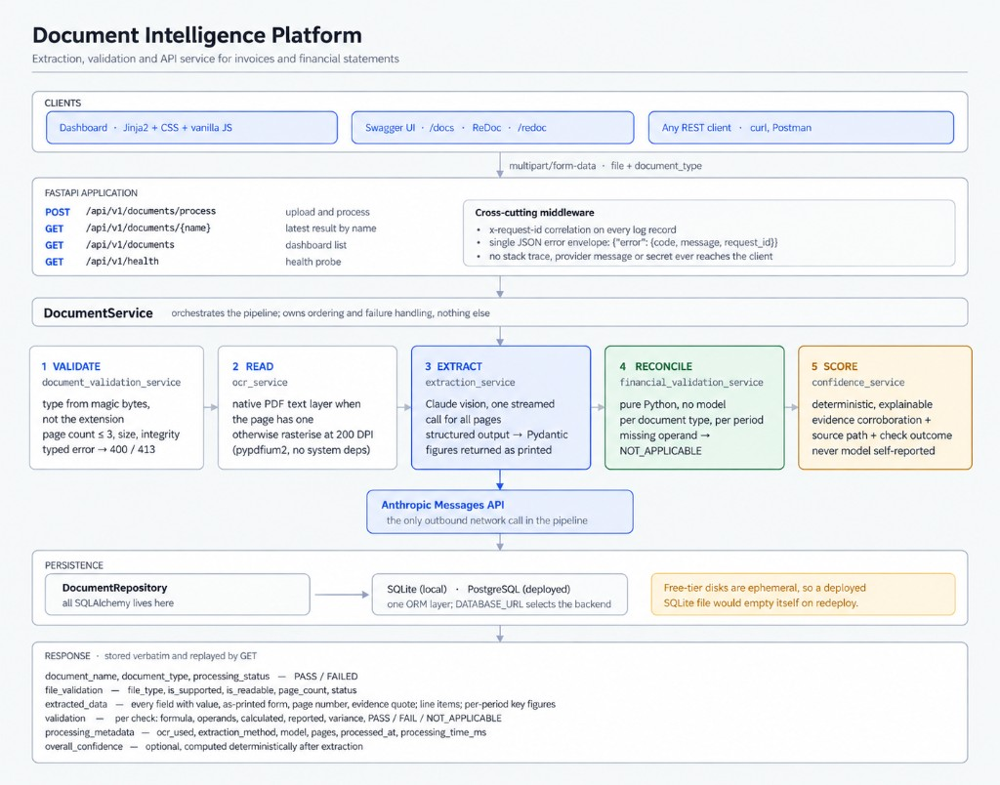

# Document Intelligence Platform

Extraction, validation and API service for invoices and financial statements.

Upload a PDF, JPG or PNG of up to three pages, pick the document type, and the
service validates the file, reads every page, extracts all visible fields and
table values with page-level evidence, runs the financial reconciliations for
that document type, stores the result and serves it back through a REST API and
a dashboard.



---

## Deployment URLs

| What | URL |
|---|---|
| Frontend (dashboard) | <https://document-intelligence-api-lffm.onrender.com> |
| Backend API base | <https://document-intelligence-api-lffm.onrender.com> |
| Swagger / OpenAPI | <https://document-intelligence-api-lffm.onrender.com/docs> |
| Health endpoint | <https://document-intelligence-api-lffm.onrender.com/api/v1/health> |
| Public repository | <https://github.com/ZiyaSadik/document-intelligence-platform> |

The frontend and the API are one deployed service: the dashboard is served by
the same FastAPI process that serves the API, so there is one URL, one origin
and no CORS configuration to get wrong.

The live dashboard holds a **curated demonstration set** — 13 processed
documents covering all four types, both read paths (one statement is read from
its native PDF text layer, the rest are rasterised and read visually), a
two-page statement, a GST invoice and two thermal receipts — plus one
deliberately rejected unsupported file, so the input-control layer's error
envelope is visible too. Uploading more through the UI simply adds rows.

See [`docs/DEPLOYMENT.md`](docs/DEPLOYMENT.md) for the step-by-step deploy
runbook.

---

## Contents

- [What the pipeline does](#what-the-pipeline-does)
- [Why these technology choices](#why-these-technology-choices)
- [Local setup](#local-setup)
- [Environment variables](#environment-variables)
- [API reference](#api-reference)
- [Financial validation rules and tolerance](#financial-validation-rules-and-tolerance)
- [Confidence scoring](#confidence-scoring)
- [Persistence](#persistence)
- [Project structure](#project-structure)
- [Testing](#testing)
- [Sample outputs](#sample-outputs)
- [Known limitations](#known-limitations)
- [What I would change for production](#what-i-would-change-for-production)
- [AI tool usage declaration](#ai-tool-usage-declaration)

---

## What the pipeline does

```
upload → validate → read → extract → reconcile → score → store → respond
```

**1. Validate** (`document_validation_service.py`) — runs before anything
expensive. The file type comes from the **magic bytes**, not the extension or
the browser-supplied `Content-Type`, so a text file renamed `invoice.pdf` is
rejected. Also checks for an empty file, the size ceiling, PDF/image structural
integrity, and the three-page limit. Each failure maps to a typed error and a
specific HTTP status.

**2. Read** (`ocr_service.py`) — per page, one of two paths:

- The page has a usable native text layer (≥ `TEXT_LAYER_MIN_CHARS`): the text
  goes to the model as text. Cheaper, exact, no OCR error.
- It does not: the page is rasterised at `RASTER_DPI` and read visually.

`processing_metadata.ocr_used` and `extraction_method` report which path ran.

> **Why rasterisation is not an edge case here.** In the supplied corpus, 29 of
> 30 statement PDFs have *no text layer and no embedded image* — the text is
> painted as vector path outlines, with an empty resource dictionary and roughly
> a megabyte of path-fill operators per page. `pdfplumber` and `pypdf` both
> return **zero characters** for those pages even though they look perfectly
> normal on screen. A text-layer-only solution extracts nothing from 29 of the
> 30 files. Only `Consolidated Cash Flow Statement 2022.pdf` has real text, and
> it exercises the fast path.

**3. Extract** (`extraction_service.py`) — one streamed Claude call per
document with all pages in a single request, so a value whose context spans a
page break can still be resolved. The response is constrained by a JSON schema
derived from the Pydantic models in `schemas/extraction.py`.

Every figure crosses this boundary **as a string, verbatim as printed** —
`"(1,234.56)"`, `"1,23,456.78"`, `"-"`. The model transcribes; the application
interprets. That keeps sign conventions, digit grouping and "no value" tokens
deterministic and unit-tested rather than dependent on the model doing
arithmetic, and it lets the confidence model verify that a figure really appears
in the evidence text the model quoted.

**4. Reconcile** (`financial_validation_service.py`) — pure Python, no model
involvement, so the arithmetic is checkable by hand. Runs once **per
comparative period**.

**5. Score** (`confidence_service.py`) — deterministic confidence computed
after the fact from observable signals. Optional per the brief; see below.

**6. Store** (`document_repository.py`) — the full response is persisted
verbatim, so `GET` replays exactly what `POST` returned. Rejected uploads are
recorded with `processing_status: FAILED` rather than silently dropped, so the
dashboard shows what was attempted.

---

## Why these technology choices

| Choice | Reason |
|---|---|
| **FastAPI** | Generates the OpenAPI/Swagger document the brief requires directly from the Pydantic response models, so the documentation cannot drift from the implementation. |
| **`pypdfium2` for rasterisation** | Ships as a **self-contained binary wheel**. No poppler, no ghostscript, no `apt-get` layer — the container image installs identically on a laptop and on a free-tier host. `pdf2image` needs a poppler binary; PyMuPDF is AGPL. |
| **`pdfplumber` for the text layer** | Cheap, exact fast path for the PDFs that do have one. |
| **Claude vision for extraction** | These are dense multi-column comparative financial tables and faded thermal receipts. Associating a row caption with the right period column is precisely where classical OCR (Tesseract-class) fails, and extraction accuracy is the largest single scoring component. |
| **`claude-opus-5`** | Highest accuracy for table reading. Configurable via `ANTHROPIC_MODEL`; `claude-sonnet-5` costs materially less if you want to trade some accuracy. |
| **Structured outputs** (`output_format=`) | Schema-constrained responses, validated into Pydantic models — no prompt-and-hope JSON parsing. |
| **Streaming** | A statement with 50+ line items across two periods, each with evidence, is a long JSON payload; a blocking call risks an HTTP timeout. |
| **SQLAlchemy with `DATABASE_URL`** | One ORM layer, SQLite locally and PostgreSQL deployed. See [Persistence](#persistence) for why that matters on free tiers. |
| **Jinja2 + hand-written CSS + vanilla JS** | The brief asks for HTML/CSS and explicitly says a React/Node stack is not required. No build step means the deployed artefact is exactly what is in the repository. |

---

## Local setup

Requires Python 3.12+. No system packages are needed.

```bash
git clone https://github.com/ZiyaSadik/document-intelligence-platform.git
cd document-intelligence-platform

python -m venv .venv
source .venv/bin/activate        # Windows: .venv\Scripts\activate
pip install -r backend/requirements.txt

cp .env.example .env             # then add your ANTHROPIC_API_KEY
```

Run it:

```bash
cd backend && uvicorn app.main:app --reload --port 8000
```

- Dashboard — <http://localhost:8000/>
- Swagger UI — <http://localhost:8000/docs>
- Health — <http://localhost:8000/api/v1/health>

Or with Docker:

```bash
docker build -t docintel . && docker run -p 8000:8000 --env-file .env docintel
```

The application starts and serves reads even with no API key configured; only
uploads are refused, with `MODEL_NOT_CONFIGURED`, and the dashboard shows a
banner saying so.

---

## Environment variables

Every value is read from the environment. **No secret has a default and no key
is committed.** See [`.env.example`](.env.example) for the full annotated list.

| Variable | Default | Purpose |
|---|---|---|
| `ANTHROPIC_API_KEY` | *(none)* | Required for extraction. |
| `ANTHROPIC_MODEL` | `claude-opus-5` | Extraction model. |
| `ANTHROPIC_EFFORT` | `high` | Reasoning effort: `low`…`max`. |
| `ANTHROPIC_MAX_TOKENS` | `32000` | Output ceiling; raise for very long statements. |
| `ANTHROPIC_TIMEOUT_SECONDS` | `300` | Per-request timeout. |
| `ANTHROPIC_MAX_RETRIES` | `2` | SDK-level transport retries. |
| `DATABASE_URL` | `sqlite:///./data/app.db` | `postgresql://…` in deployment. |
| `MAX_UPLOAD_MB` | `20` | Upload size ceiling. |
| `MAX_PAGE_COUNT` | `3` | Page limit from the brief. |
| `TEXT_LAYER_MIN_CHARS` | `200` | Below this a page is rasterised. |
| `RASTER_DPI` | `200` | Rendering resolution. |
| `MAX_IMAGE_EDGE_PX` | `2000` | Longest-edge cap before encoding. |
| `JPEG_QUALITY` | `85` | Encoding quality. |
| `VALIDATION_ABS_TOLERANCE` | `0.1` | Absolute reconciliation tolerance. |
| `VALIDATION_REL_TOLERANCE` | `1e-5` | Relative tolerance term in the combined rule. |
| `LOG_LEVEL` / `LOG_JSON` | `INFO` / `true` | JSON logs in deployment, text locally. |
| `ENVIRONMENT` | `local` | Reported by `/api/v1/health`. |

---

## API reference

Base path `/api/v1`. Interactive documentation at `/docs`.

| Method | Endpoint | Purpose |
|---|---|---|
| `POST` | `/documents/process` | Upload and process a document. |
| `GET` | `/documents/{document_name}` | Latest stored result for a name. |
| `GET` | `/documents` | List processed documents (dashboard). |
| `GET` | `/health` | Health probe. |

### POST /api/v1/documents/process

```bash
curl -X POST "$BASE/api/v1/documents/process" \
  -F "file=@Consolidated Balance Sheet 2024.pdf" \
  -F "document_type=balance_sheet"
```

`document_type` is one of `invoice`, `balance_sheet`, `profit_and_loss`,
`cash_flow_statement`. Processing is synchronous.

Abridged response:

```jsonc
{
  "document_name": "Consolidated Balance Sheet 2024.pdf",
  "document_type": "balance_sheet",
  "processing_status": "PASS",
  "overall_confidence": 0.87,
  "file_validation": {
    "file_type": "application/pdf",
    "is_supported": true,
    "is_readable": true,
    "page_count": 1,
    "status": "PASS"
  },
  "extracted_data": {
    "entity_name": { "value": "HDFC Bank Limited", "page_number": 1,
                     "confidence": 0.85,
                     "evidence": { "source_text": "HDFC Bank Limited", "page_number": 1 } },
    "currency":  { "value": "INR", "raw_value": "INR", "confidence": 0.8 },
    "units":     { "value": "in crore", "raw_value": "₹ in crore" },
    "periods": [
      { "label": "March 31, 2024", "period_end_date": "2024-03-31" },
      { "label": "March 31, 2023", "period_end_date": "2023-03-31" }
    ],
    "line_items": [
      {
        "label": "Deposits",
        "section": "Capital and Liabilities",
        "is_total": false,
        "page_number": 1,
        "evidence": { "source_text": "Deposits 23,79,786.28 18,83,394.65", "page_number": 1 },
        "values": {
          "March 31, 2024": { "value": 2379786.28, "raw_value": "23,79,786.28", "confidence": 0.9 },
          "March 31, 2023": { "value": 1883394.65, "raw_value": "18,83,394.65", "confidence": 0.9 }
        }
      }
    ],
    "key_figures": {
      "March 31, 2024": {
        "total_assets":      { "value": 4030194.14, "source_label": "Total Assets", "page_number": 1 },
        "total_liabilities": { "value": 4030194.14, "source_label": "Total Capital and Liabilities" },
        "total_equity":      { "value": null, "source_label": null }
      }
    },
    "missing_fields": []
  },
  "validation": {
    "checks": [
      {
        "name": "balance_sheet_equation_check",
        "description": "Total capital and liabilities should equal total assets.",
        "formula": "total_capital_and_liabilities = total_assets",
        "period": "March 31, 2024",
        "operands": { "total_capital_and_liabilities": 4030194.14, "total_assets": 4030194.14 },
        "calculated_value": 4030194.14,
        "reported_value": 4030194.14,
        "variance": 0.0,
        "status": "PASS"
      }
    ],
    "overall_status": "PASS",
    "issues": [],
    "tolerance": { "absolute": 0.1, "relative": 0.00001 }
  },
  "processing_metadata": {
    "ocr_used": true,
    "extraction_method": "vision_llm",
    "model": "claude-opus-5",
    "pages_processed": 1,
    "processed_at": "2026-09-11T04:12:00Z",
    "processing_time_ms": 24310
  }
}
```

### GET /api/v1/documents/{document_name}

```bash
curl "$BASE/api/v1/documents/Consolidated%20Balance%20Sheet%202024.pdf"
```

Returns the **most recent** result for that name (matching is
case-insensitive). Prior runs are retained in the database.

### GET /api/v1/documents

```bash
curl "$BASE/api/v1/documents?limit=20&document_type=invoice&search=x510"
```

Returns one row per distinct document name — the latest run — newest first.
Supports `limit`, `offset`, `document_type` and `search`.

### GET /api/v1/health

```jsonc
{ "status": "ok", "version": "1.0.0", "environment": "production",
  "database": "connected", "extraction_configured": true,
  "model": "claude-opus-5", "timestamp": "2026-09-11T04:12:00Z" }
```

### Errors

Every failure — validation, not-found, upstream, unexpected — returns the same
envelope, with the correlation id that ties it to the server logs:

```json
{ "error": { "code": "UNSUPPORTED_FILE_TYPE",
             "message": "Only PDF / JPG / PNG documents are supported.",
             "request_id": "a1b2c3d4e5f6" } }
```

| Code | Status | Meaning |
|---|---|---|
| `DOCUMENT_VALIDATION_FAILED` | 400 | Generic upload-validation failure (base for file-control errors). |
| `UNSUPPORTED_FILE_TYPE` | 400 | The bytes are not a PDF, JPEG or PNG. |
| `EMPTY_FILE` | 400 | Zero-byte upload. |
| `CORRUPTED_FILE` | 400 | Unreadable or password-protected. |
| `PAGE_LIMIT_EXCEEDED` | 400 | More than `MAX_PAGE_COUNT` pages. |
| `FILE_TOO_LARGE` | 413 | Over `MAX_UPLOAD_MB`. |
| `INVALID_DOCUMENT_TYPE` | 422 | Unknown `document_type`. |
| `INVALID_REQUEST` | 422 | Missing or malformed request fields. |
| `DOCUMENT_NOT_FOUND` | 404 | No stored result for that name. |
| `OCR_FAILED` | 422 | No readable content could be obtained. |
| `EXTRACTION_FAILED` | 502 | The model could not produce a valid result. |
| `MODEL_UNAVAILABLE` | 503 | Rate limited, upstream 5xx, or unreachable. |
| `MODEL_QUOTA_EXCEEDED` | 503 | Anthropic credit, billing or usage-quota exhaustion. |
| `MODEL_NOT_CONFIGURED` | 503 | `ANTHROPIC_API_KEY` unset or rejected. |
| `STORAGE_FAILED` | 503 | The database write failed. |
| `INTERNAL_ERROR` | 500 | Anything unexpected. |

Internal detail (stack traces, provider messages, file paths) is written to the
log and **never** to the response body; there is a test asserting this.

---

## Financial validation rules and tolerance

All reconciliations are deterministic Python. Every rule runs **once per
comparative period**, and any missing operand yields `NOT_APPLICABLE` — never a
substituted zero, which would fabricate a reconciliation the document does not
support. A `NOT_APPLICABLE` check never fails a document.

Parenthesised figures are parsed as negative before any rule runs.

**A printed dash is nil; a blank is absent.** In a financial statement `-` is
the standard notation for zero — the document *does* report the value — whereas
a cell the model could not read is genuinely unknown. `parse_money` returns
`0.0` for `-`, `–`, `—` and `Nil`, and `None` for `N/A`, `not reported` and an
empty cell. Collapsing the two either invents a zero or discards a real one; on
the sample balance sheet it was the difference between four reconciliations
running and four returning `NOT_APPLICABLE`.

### Invoice

| Check | Formula |
|---|---|
| `line_item_{n}_amount_check` | `quantity × unit_price = amount` |
| `line_items_subtotal_check` | `sum(line amounts) = subtotal` (or the total, when no subtotal is printed) |
| `invoice_total_check` | `subtotal + tax − discount (+ rounding) = total` |
| `cash_change_check` | `cash_paid − total = change` |

Two things make the total check less trivial than it looks, both found by
running the real invoices:

- **The tax treatment is derived from the figures, not from the model.** On the
  sample GST invoice the model reported `tax_inclusive: true` while
  `subtotal + tax` lands on the printed total to the paisa. So the check tries
  both readings, applies whichever the document's own numbers support, and
  records which it used in its `description`. It falls back to the declared
  flag only when the arithmetic genuinely cannot distinguish them — a real
  mismatch still fails.
- **Split tax components are recovered.** Indian GST invoices print CGST and
  SGST (or IGST) separately and never a combined tax line, so there is nothing
  for the model to put in `tax_amount`. When it is absent, the tax charges
  among the other extracted fields are summed, and each component appears as
  its own operand so the sum is auditable. Registration numbers like
  `GSTIN/UIN` are excluded — they match on "gst" and parse as numbers.

Where no subtotal is printed at all, common on till receipts, the line-item sum
becomes the taxable base.

### Balance sheet

| Check | Formula |
|---|---|
| `balance_sheet_equation_check` | `total capital and liabilities = total assets` |
| `section_sum_check::<section>` | the component rows of each section sum to that section's own total row |

The section check is derived from the **document's own structure** — its section
headings and total flags — not from a fixed caption list, so it still fires on a
statement whose wording nobody anticipated.

### Profit and loss

| Check | Formula |
|---|---|
| `total_income_check` | `interest_earned + other_income = total_income` |
| `total_expenditure_check` | `interest_expended + operating_expenses + provisions_and_contingencies = total_expenditure` |
| `net_profit_before_minority_interest_check` | `total_income − total_expenditure = profit before minority interest` |
| `net_profit_attributable_to_group_check` | `profit before minority interest − minority interest = profit attributable to the group` |
| `appropriation_check` | `current profit + profit brought forward + restructuring adjustment = total available for appropriation` |

### Cash flow statement

| Check | Formula |
|---|---|
| `net_change_in_cash_check` | `operating + investing + financing + fx adjustment = net increase in cash` |
| `closing_cash_check` | `opening cash + net increase + cash acquired on amalgamation = closing cash` |

The FX/translation and amalgamation lines are genuinely optional — most years do
not print them — so their absence contributes zero rather than voiding the
check. The P&L appropriation check treats a restructuring line the same way: a
2017 statement in the corpus prints `Impact on amalgamation [Refer Schedule
18(1)]` between the year's profit and the brought-forward balance, and the
check was short by exactly that figure until it was counted. The three activity subtotals are not optional: if one is missing the
check is `NOT_APPLICABLE`.

### Tolerance

A check passes when the combined allowance holds:

`|calculated − reported| ≤ VALIDATION_ABS_TOLERANCE + VALIDATION_REL_TOLERANCE × scale`

where `scale = max(|calculated|, |reported|)`, `VALIDATION_ABS_TOLERANCE` defaults
to `0.1`, and `VALIDATION_REL_TOLERANCE` defaults to `1e-5`.

The absolute term absorbs rounding at printed precision (a sum of many figures
each rounded to 2dp can drift ~0.1); the relative term is a small safety valve
so that drift can grow with magnitude. An OR of absolute-or-relative is too
loose at both ends.

### Mapping captions to concepts

The rules are written in terms of ideas ("Total Income"); documents print
captions like `"II. Total Expenditure"` or
`"Net cash flow (used in) / from operating activities"`.
`concept_matcher.py` bridges them with a declarative registry of required
tokens, alternatives and disqualifiers, matched on a normalised caption
(case-folded, punctuation stripped, leading enumerators removed).

Three details that matter in practice, each found by running the real corpus:

- **Matching is section-aware.** Real published statements do not print
  "Total Income" — they print a bare **`Total`** once per section and let the
  heading (`I INCOME`, `II EXPENDITURE`) say which total it is. A rule may gate
  on the row's section, and a concept may carry several rules; the best match
  across all of them wins. Before this, every check on those documents came
  back `NOT_APPLICABLE` — the extraction was correct and the matcher was not.
- **Rows with no figure in any period are excluded.** The section heading
  `"Cash flows from operating activities:"` reads exactly like the concept and
  would otherwise out-rank the real subtotal row beneath it.
- An exact caption match always beats a token match, so `"Total Income"` never
  loses to `"Total Income from operations"`, and disqualifying tokens keep
  `"Add: Brought forward consolidated profit attributable to the group"` from
  being mistaken for the attributable-profit row itself.

Captions are matched on stems where the wording varies —
`"Less : Minorities' Interest"` and `"Minority interest"` resolve to the same
concept. `tests/test_extraction.py` pins these against captions copied verbatim
from the supplied corpus.

---

## Confidence scoring

Optional per the brief, and implemented — but nothing here asks the model how
confident it is. A self-reported number is not evidence. The score is computed
**after** extraction from four independently checkable signals:

| Signal | Effect | Rationale |
|---|---|---|
| Source path | base `0.75` native text / `0.60` rasterised | A PDF text layer is exact; a rendered page was read visually. |
| Evidence corroboration | `+0.20` | The extracted number is actually present in the source text the model quoted — the strongest single signal it was transcribed rather than inferred. |
| Evidence completeness | `+0.05` each for a page number and a quote | Traceable values are more trustworthy. |
| Validation agreement | `+0.10` pass / `−0.30` fail | A figure inside a failing reconciliation is suspect. |

Clamped to `[0.05, 0.99]`. `overall_confidence` is the mean of the scored
fields. A field the document does not report scores `null`, not zero — there is
nothing to be confident about, and zero would read as "certainly wrong".

Values below `0.70` are highlighted in the dashboard.

---

## Persistence

Table `processed_documents`, one row per processing run (append-only):

| Column | Notes |
|---|---|
| `id` | Primary key. |
| `document_name` | Indexed. |
| `document_type`, `processing_status`, `validation_status` | |
| `overall_confidence`, `page_count`, `ocr_used`, `processing_time_ms` | Dashboard columns. |
| `result_json` | The full response, stored verbatim. |
| `processed_at` | Indexed, with a composite index on `(document_name, processed_at)`. |

- **Retrieval by name** returns the newest row for that name. Earlier runs are
  retained, so re-processing is non-destructive and "what changed?" is
  answerable.
- **The list endpoint** collapses to the latest run per distinct name.
- **Failed attempts are stored too**, so a rejected upload appears on the
  dashboard as `FAILED` instead of vanishing.

`DATABASE_URL` selects the backend and nothing else changes. **Use PostgreSQL in
deployment.** A free-tier container filesystem is ephemeral: a deployed SQLite
file is wiped on every redeploy and on cold start, so the dashboard would
silently empty itself mid-evaluation. `render.yaml` provisions a free PostgreSQL
instance and wires `DATABASE_URL` automatically.

---

## Project structure

```
backend/app/
  main.py                          FastAPI app, middleware, exception handlers
  api/routes/                      documents.py · health.py · ui.py
  core/                            config · database · logging · exceptions
  models/document.py               ORM model
  schemas/                         document.py (API) · extraction.py (model I/O) · enums.py
  services/
    document_validation_service.py input control
    ocr_service.py                 text layer / rasterisation
    extraction_service.py          Claude vision + structured output
    concept_matcher.py             caption → concept registry
    financial_validation_service.py deterministic reconciliation
    confidence_service.py          explainable scoring
    result_builder.py              published extracted_data shape
    document_service.py            orchestration
  repositories/document_repository.py   all SQLAlchemy
  utils/                           numbers.py · files.py
  tests/                           test_api · test_validation · test_extraction
frontend/
  templates/                       base · dashboard · document_result
  static/css/app.css               hand-written, no framework
  static/js/                       common · dashboard · result
docs/                              architecture.png · DEPLOYMENT.md · solution_presentation.pdf · solution_presentation.pptx
sample_outputs/                    real pipeline output for the test matrix
scripts/                           generate_samples.py · generate_architecture.py · generate_presentation.py
Dockerfile · render.yaml · .env.example · .gitignore
```

---

## Testing

```bash
cd backend && pytest
```

**140 tests, no network access** — the Anthropic client is stubbed throughout,
so the suite runs identically in CI and with no API key.

- `test_validation.py` — unsupported type, extension/magic-byte mismatch, empty,
  corrupted PDF and image, oversize, page limit; filename sanitisation including
  path traversal; and `parse_money` across parentheses, Indian digit grouping,
  currency symbols, Unicode minus, trailing minus and null tokens.
- `test_extraction.py` — every reconciliation rule with concrete figures, per-period
  independence, `NOT_APPLICABLE` on a missing operand, tolerance boundaries,
  tax-inclusive receipts, caption→concept matching (including the section-heading
  shadowing case), confidence signals, and the published payload shape.
- `test_api.py` — health, OpenAPI completeness, all four document types, multi-page
  PDFs, every rejection path and its error envelope, no internal detail in error
  bodies, get-by-name returning the latest, case-insensitive lookup, list
  collapsing/filtering/pagination, and both rendered pages.

---

## Sample outputs

[`sample_outputs/`](sample_outputs/) holds real pipeline output — generated by
running the actual code against the supplied documents, never hand-written
(`scripts/generate_samples.py`). `index.json` summarises the set.

| Sample | Type | Read path | Checks | Failed | N/A | Confidence |
|---|---|---|---|---:|---:|---:|
| `Consolidated Balance Sheet 2024.pdf` | balance sheet | rasterised | 6 | 0 | 0 | 0.90 |
| `Consolidated Profit & Loss 2022.pdf` | P&L | rasterised | 10 | 0 | 0 | 0.84 |
| `Consolidated Cash Flow Statement 2022.pdf` | cash flow | **text layer** | 4 | 0 | 0 | 0.98 |
| `Consolidated Cash Flow Statement 2019.pdf` | cash flow | rasterised, 2 pages | 4 | 0 | 0 | 0.81 |
| `X51005361895.jpg` | invoice | scanned receipt | 4 | 0 | 0 | 0.91 |
| `20251118_000612.jpg` | invoice | 4.4 MB phone photo | 9 | 0 | **7** | 0.90 |
| `README.md` | — | rejected | — | — | — | — |

**37 checks, 0 failures — every reconciliation that ran did so to a variance of
0.00**, across both comparative periods on each statement.

The two cases that are not clean passes are the interesting ones, and they
cover the brief's testing requirements:

- **`20251118_000612.jpg`** — the quantity column on this phone photo is not
  legible, so all six per-line `quantity × unit_price` checks report
  `NOT_APPLICABLE` rather than guessing. The document-level total still
  reconciles exactly, because the tax it splits across CGST and SGST is
  recovered from the components. This is the missing/unreadable-value scenario.
- **`README.md`** — an unsupported file, captured with the 400 error envelope
  it produced.

The source documents themselves are **not committed** — they were supplied for
the assessment and are not ours to redistribute. Unzip them to
`data/samples/` (gitignored) to regenerate:

```bash
python scripts/generate_samples.py                    # the whole matrix
python scripts/generate_samples.py --only invoice     # one type
python scripts/generate_samples.py --reindex          # rebuild index.json, no API calls
```

---

## Known limitations

1. **Extraction accuracy is bounded by the vision model.** Values are checked
   against the source document and grounded with evidence, but a faint or
   skewed scan can still be misread. The financial reconciliations catch
   *internally inconsistent* extractions; they cannot catch a value that is
   wrong in a self-consistent way.
2. **Column-level reads can fail on a photograph.** On the sample phone photo
   the quantity column is not legible, so six per-line checks correctly report
   `NOT_APPLICABLE`. Higher `RASTER_DPI` does not help — the source image
   itself is the limit.
3. **The concept registry is English-language and oriented to the statement
   conventions in scope** (including Indian bank formats: "Interest Earned",
   "Provisions and Contingencies"). An unusual caption may leave a check
   `NOT_APPLICABLE`. The full line-item table is still extracted — only the
   named reconciliation is skipped — and adding a caption is a one-line change.
4. **Processing is synchronous** and takes roughly 15–40 s per page for
   rasterised statements. The brief permits this; it would not survive real
   concurrency.
5. **The section-sum check needs unambiguous structure** — exactly one total row
   and at least two component rows per section — so it skips sections with
   nested subtotals rather than reporting a wrong result.
6. **Three pages maximum**, per the brief. Nothing in the design prevents more;
   the limit is a configured constant.
7. **No authentication.** The API is open, as the brief's evaluation flow needs.
8. **`overall_confidence` is a heuristic**, deliberately explainable rather than
   calibrated. It has not been validated against labelled ground truth.
9. **Extraction is the slow step**: 45–60 s for a rasterised statement page on
   `claude-opus-5`. `claude-sonnet-5` is materially faster and cheaper; set
   `ANTHROPIC_MODEL` if throughput matters more than the last few percent of
   accuracy.

---

## What I would change for production

- **Make processing asynchronous.** Return `202` with a job id, process on a
  queue (Celery/RQ/Arq), stream progress. Synchronous multi-page vision calls
  hold a worker for tens of seconds.
- **Cache by content hash.** Re-uploading an identical file should not pay for
  another model call.
- **Store the source document** in object storage and link evidence to page
  coordinates, so the UI can highlight the exact region a value came from —
  bounding boxes rather than a quoted line.
- **Calibrate confidence** against a labelled set and publish a reliability
  curve, replacing the current heuristic weights with fitted ones.
- **Add authentication, per-tenant isolation and rate limiting**, plus a spend
  cap on the model account.
- **Move the concept registry into configuration** so a finance analyst can add
  caption synonyms without a deploy, and add a review UI for corrections that
  feed back as few-shot examples.
- **Ship an accuracy eval harness**: a labelled corpus, field-level precision
  and recall per document type, run in CI so a prompt change cannot silently
  regress extraction.
- **Observability**: OpenTelemetry traces across the pipeline stages, and
  per-request token/cost accounting from `response.usage`.
- **Schema migrations** with Alembic instead of `create_all`.
- **Prompt caching** on the static system prompt to cut input cost.

---

## AI tool usage declaration

**Claude Code (Claude Opus 5)** was used throughout this build, and its use is
declared here in full:

| Area | How AI was used |
|---|---|
| Dataset investigation | Probing the supplied PDFs, which is how the vector-outline finding (29/30 files with no text layer and no embedded image) surfaced. That finding drove the rasterisation-first design. |
| Architecture and scaffolding | Drafting the module layout, service boundaries and the FastAPI/SQLAlchemy wiring. |
| Implementation | Writing most of the application code, templates and CSS, then iterating against test failures and rendered screenshots. |
| Prompts and schemas | Drafting the extraction prompts and Pydantic schemas. |
| Tests | Generating the test matrix and the statement/invoice factories. |
| Documentation | Drafting this README, the deployment runbook and the presentation. |

The Anthropic API is also a **runtime dependency** — `extraction_service.py`
calls Claude for the extraction step itself.

Every design decision was reviewed and verified: the tests were run, the
frontend was inspected in a browser, and extracted figures were spot-checked
against the source documents. I can explain, debug and modify any part of this
codebase.
